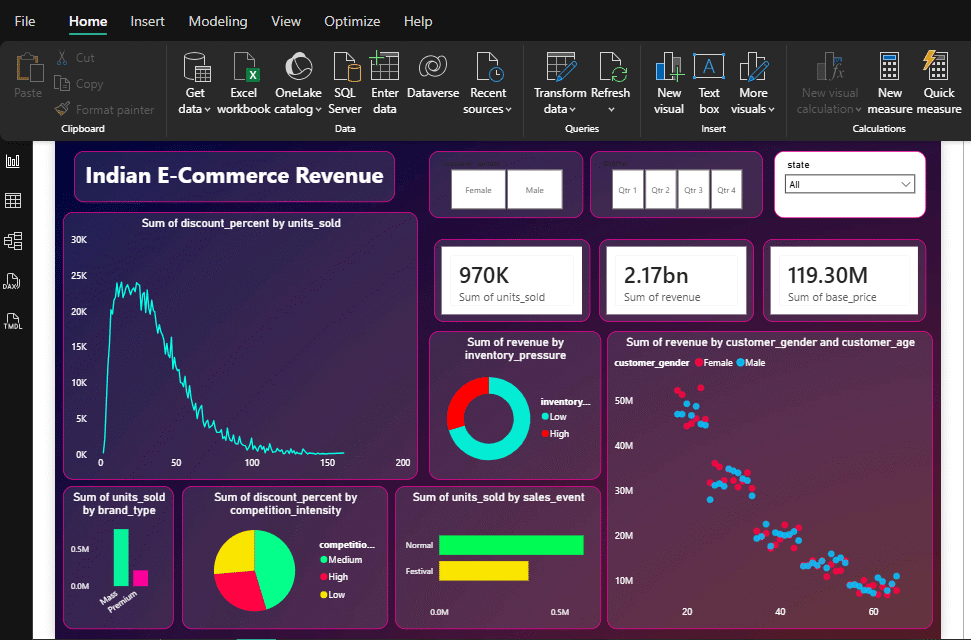
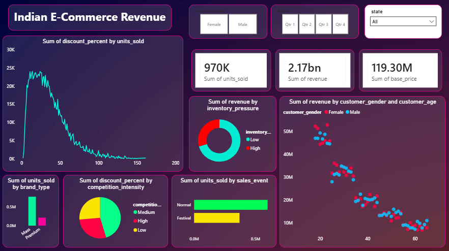

<div align="center">

# 📊 Indian E-Commerce Revenue Dashboard

### Enterprise Business Intelligence Solution Built with Power BI

Transforming raw transactional data into strategic revenue insights for the Indian e-commerce market

<br/>


<br/>

[📥 Download Dashboard](#-installation--usage) • [🖼 View Preview](#-live-dashboard-preview) • [📊 Key Insights](#-key-performance-indicators-kpis) • [🛠 Tech Stack](#-tools--technologies)

</div>

---

## 📖 Table of Contents

- [Project Overview](#-project-overview)
- [Live Dashboard Preview](#-live-dashboard-preview)
- [Business Problem](#-business-problem)
- [Project Objectives](#-project-objectives)
- [Key Performance Indicators](#-key-performance-indicators-kpis)
- [Dashboard Features & Insights](#-dashboard-features--insights)
- [Dataset Description](#-dataset-description)
- [Tools & Technologies](#-tools--technologies)
- [Project Architecture](#-project-architecture)
- [Installation & Usage](#-installation--usage)
- [Business Value & Impact](#-business-value--impact)
- [Key Learnings](#-key-learnings)
- [Future Enhancements](#-future-enhancements)
- [Repository Structure](#-repository-structure)
- [Connect With Me](#-connect-with-me)

---

## 📌 Project Overview

The **Indian E-Commerce Revenue Dashboard** is an end-to-end business intelligence project built on **Power BI**, designed to analyze revenue performance, customer purchasing behavior, discount impact, and inventory pressure across the Indian e-commerce market.

This project simulates a real-world analytics workflow — from raw transactional data to a fully interactive executive dashboard — enabling stakeholders to make faster, data-driven decisions on pricing, inventory, and marketing strategy.

> Built to demonstrate practical skills in **data modeling, DAX, Power Query ETL, and business storytelling** — the same workflow used by analytics teams in retail and e-commerce organizations.

---

## 🖼 Live Dashboard Preview

<div align="center">




*Interactive walkthrough — gender filter, quarter filter, and state-wise slicers in action*

<br/>



</div>

> 📌 **Note:** Download the `.pbix` file to explore the dashboard live in Power BI Desktop — full interactivity (slicers, drill-downs, cross-filtering) is best experienced there.

---

## 🎯 Business Problem

Indian e-commerce brands operate in a highly price-sensitive, festival-driven market where discounting decisions, inventory pressure, and regional competition directly impact revenue. Without a centralized view, stakeholders struggle to answer questions like:

- Which customer segments and states drive the most revenue?
- Is our discounting strategy actually improving unit sales, or eroding margin?
- How does inventory pressure correlate with revenue performance?
- Do festival sales events justify the discount depth applied?

This dashboard consolidates transactional data into a single interactive view to answer these questions in seconds instead of hours.

---

## 🎯 Project Objectives

- 📈 Analyze overall revenue and units sold performance
- 💰 Study the impact of discount percentage on sales
- 🎉 Evaluate festival vs. normal sales event performance
- 👥 Understand customer purchasing trends by age and gender
- 🏷 Compare brand types (Mass vs. Premium)
- 📦 Analyze inventory pressure influence on revenue
- ⚔️ Examine competition intensity vs. discount strategies

---

## 📊 Key Performance Indicators (KPIs)

<div align="center">

| Metric | Value |
|---|---|
| 🛒 **Total Units Sold** | 970K |
| 💵 **Total Revenue** | ₹2.17 Billion |
| 🏷 **Total Base Price** | ₹119.30 Million |

</div>

---

## 📈 Dashboard Features & Insights

### 1️⃣ Revenue & Sales Analysis
- Revenue breakdown by **Inventory Pressure** (Low vs. High)
- Revenue distribution by **Customer Gender and Age**
- Units sold comparison across **Sales Events** (Normal vs. Festival)

### 2️⃣ Discount & Competition Analysis
- Trend analysis of discount percentage vs. units sold
- Discount distribution based on competition intensity (Low, Medium, High)
- Identification of optimal discount strategies by segment

### 3️⃣ Product & Brand Insights
- Units sold by **Brand Type** (Mass vs. Premium)
- Segment-level sales performance comparison

### 4️⃣ Interactive Filtering System
- Customer Gender Filter
- Quarter Filter (Q1 – Q4)
- State-wise Filter
- Dynamic slicers for real-time, cross-filtered data exploration

---

## 📂 Dataset Description

The dataset simulates 36 months of Indian e-commerce transactional data with the following attributes:

| Field | Description |
|---|---|
| Customer Demographics | Age, Gender, State |
| Product Brand Type | Mass / Premium |
| Sales Event Type | Normal / Festival |
| Discount Percentage | % discount applied per transaction |
| Units Sold | Volume of units sold |
| Revenue | Total revenue generated |
| Base Price | Pre-discount product price |
| Inventory Pressure Indicator | Low / High |
| Competition Intensity | Low / Medium / High |

---

## 🛠 Tools & Technologies

<div align="center">

| Category | Tools Used |
|---|---|
| **Visualization** | Power BI Desktop |
| **Data Transformation** | Power Query (ETL) |
| **Calculations** | DAX (Data Analysis Expressions) |
| **Data Modeling** | Star Schema, Relationship Building |
| **UI/UX** | KPI Cards, Custom Visualizations, Slicers, Drill-downs |

</div>

---

## 🏗 Project Architecture

```
Raw CSV Data
     │
     ▼
Power Query (Data Cleaning & Transformation)
     │
     ▼
Data Modeling (Relationships & Schema Design)
     │
     ▼
DAX Measures (KPIs & Calculated Metrics)
     │
     ▼
Interactive Dashboard (Visuals, Slicers, Drill-downs)
```

**Workflow:**
1. Raw transactional CSV data ingested into Power BI
2. Cleaned and transformed using Power Query (handling nulls, data types, column splits)
3. Data model built with proper relationships between dimension and fact tables
4. Custom DAX measures written for KPIs (Total Revenue, Units Sold, Discount Impact, etc.)
5. Interactive report layer built with slicers, KPI cards, and drill-down visuals

---

## 📥 Installation & Usage

### Prerequisites
- [Power BI Desktop](https://www.microsoft.com/en-us/power-platform/products/power-bi/downloads) (free) installed on Windows

### Steps


# 1. Clone this repository
```bash
git clone https://github.com/ms00000ms0000/Power_BI_Indian_E-Commerce_Revenue_Dashboard.git
```
# 2. Navigate into the project folder
```bash
cd Power_BI_Indian_E-Commerce_Revenue_Dashboard
```

1. Download the `.pbix` file from this repository
2. Open the file using **Power BI Desktop**
3. Use slicers and filters (Gender, Quarter, State) to explore insights dynamically
4. Interact with visuals — click, hover, and drill down to analyze trends

---

## 🧠 Business Value & Impact

This dashboard enables business stakeholders to:

-  Optimize pricing and discount strategies based on real demand elasticity
-  Identify high-value customer segments by age, gender, and state
-  Improve inventory planning by correlating pressure with revenue trends
-  Compare seasonal and festival sales performance for future planning
-  Strengthen revenue monitoring and forecasting accuracy
-  Support faster, evidence-based strategic decision-making

---

## 📚 Key Learnings

- Designing business-focused, executive-ready Power BI dashboards
- Writing advanced DAX measures for KPI calculations
- Building dynamic, cross-filtered interactive reports
- Applying data storytelling techniques for non-technical stakeholders
- Converting raw, unstructured data into actionable business insights

---

## 🔮 Future Enhancements

-  Add profit and margin analysis
-  Implement sales forecasting using predictive modeling
-  Add regional heatmap visualization for state-wise performance
-  Deploy via Power BI Service for cloud-based access
-  Integrate real-time or streaming data sources
-  Add RLS (Row-Level Security) for role-based data access

---

## 📁 Repository Structure

```
Power_BI_Indian_E-Commerce_Revenue_Dashboard/
│
├── Indian_ECommerce_Revenue_Power_BI_Dashboard.pbit                                        # Main Power BI file
├── Power_BI_Indian_E-Commerce_Revenue_Dashboard.png                                        # Dashboard screenshot
├── README.md                                                                               # Project documentation
├── indian_ecommerce_dashboard_preview.gif                                                  # Dashboard Video Demostration
└── indian_ecommerce_pricing_revenue_growth_36_month.csv                                    # Source Dataset                               

```

---

## 🤝 Connect With Me

<div align="center">

**Mayank Srivastava**

Data Science Graduate | Aspiring Data Analyst / AI-ML Engineer

[](https://github.com/ms00000ms0000)
[](https://linkedin.com/in/ms8960)

<br/>

### ⭐ If you found this project useful, consider giving it a star!

</div>
